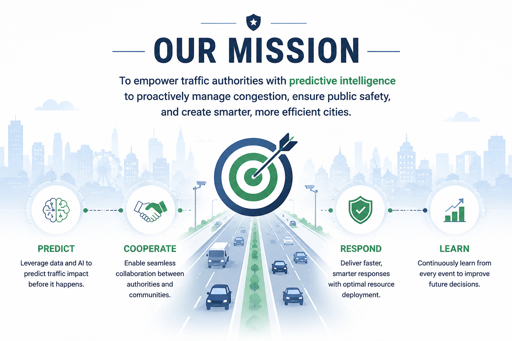
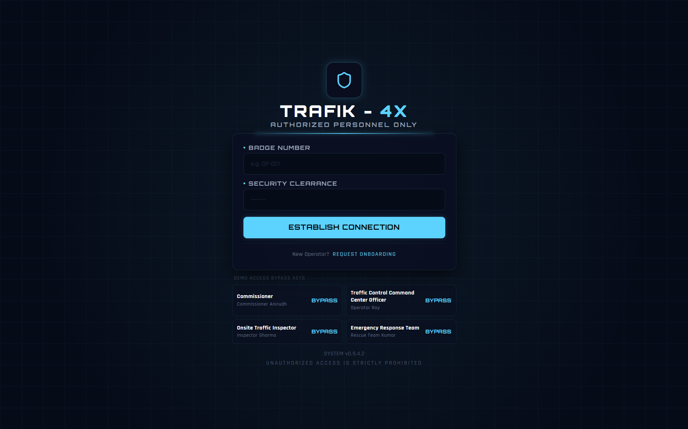
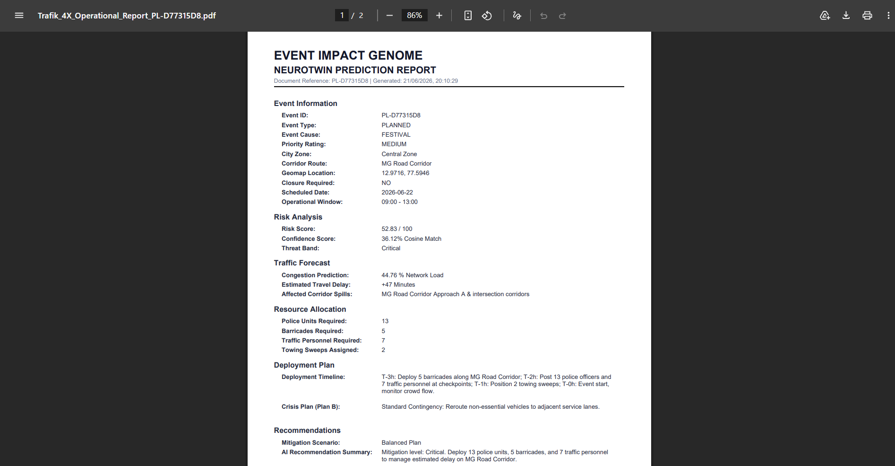
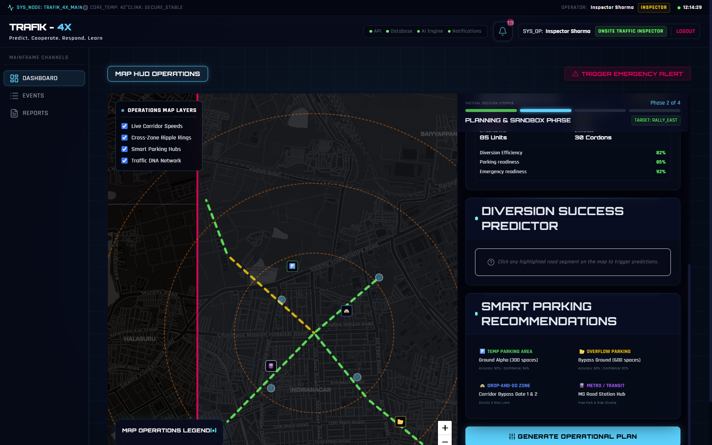
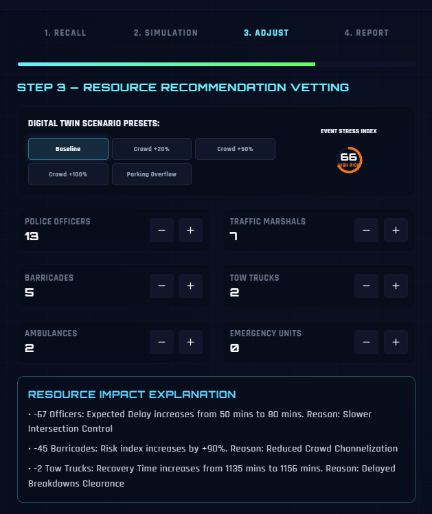
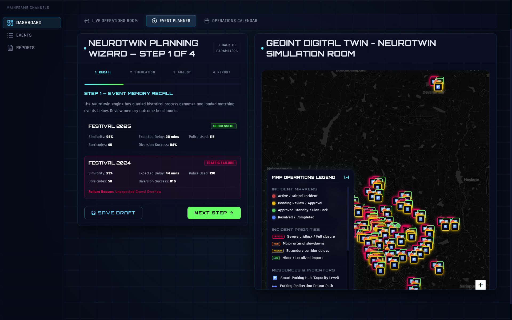
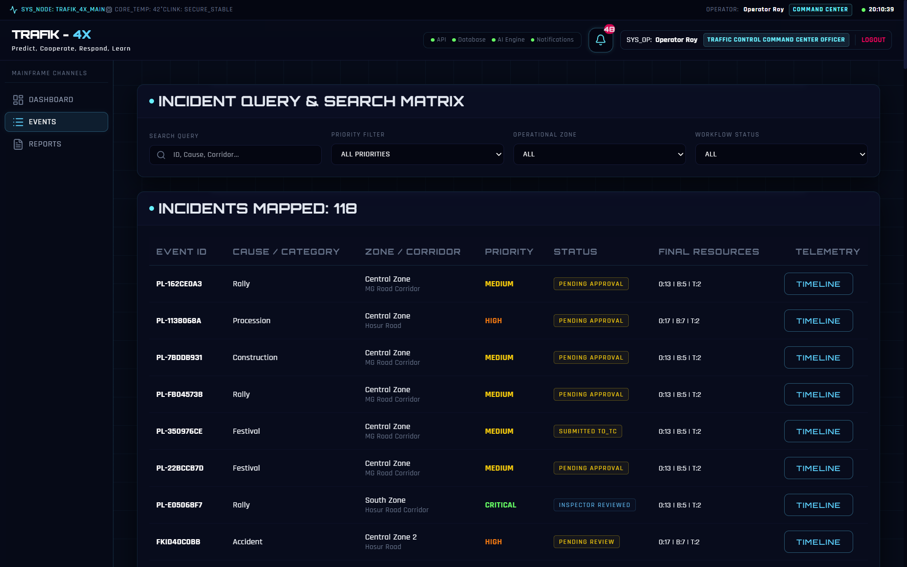
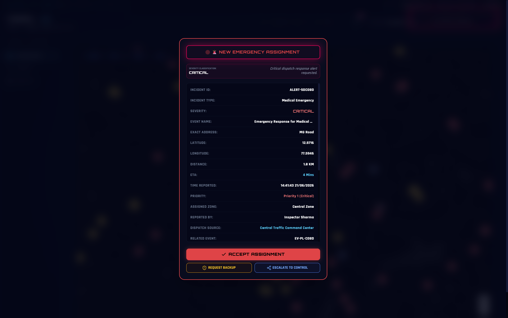

<div align="center">

# 🚦 TRAFIK-4X

### Predict. Cooperate. Respond. Learn.

</div>

TRAFIK-4X is an AI-powered traffic intelligence platform designed to help authorities predict and manage event-driven congestion before it occurs.

The platform transforms historical and real-time event data into actionable recommendations for manpower deployment, barricading strategies, diversion planning, and traffic response operations.

---

# 🎯 Mission

<div align="center">



</div>

Empowering traffic authorities with predictive intelligence to proactively manage congestion and improve urban mobility.

---

# 📌 Problem Statement

## Event-Driven Congestion (Planned & Unplanned)

### Operational Challenge

Political rallies, festivals, sports events, construction activities, and sudden gatherings create localized traffic breakdowns.

### Why It's Hard Today

- Event impact is not quantified in advance.
- Resource deployment is experience-driven.
- No post-event learning system.

### Problem Statement Direction

**How can historical and real-time data be used to forecast event-related traffic impact and recommend optimal manpower, barricading, and diversion plans?**

---

# 💡 Our Solution

TRAFIK-4X leverages Artificial Intelligence and historical event intelligence to forecast traffic impact before congestion occurs.

The platform provides predictive insights, operational recommendations, and continuous learning mechanisms that help authorities make faster and more informed decisions.

---

# ✨ Features

<div align="center">



</div>

---

## 📊 Event Impact Prediction



Predicts the severity of traffic congestion using historical event data, event characteristics, and real-time conditions.

---

## 🚧 Diversion Recommendation Engine



Generates optimized diversion strategies to minimize congestion and maintain smooth traffic flow around affected areas.

---

## 👮 Resource Allocation Planning



Recommends the required manpower, barricades, tow vehicles, and operational resources based on predicted impact.

---

## 🧠 Digital Twin Simulation



Evaluates multiple response scenarios before deployment, helping authorities choose the most effective strategy.

---

## 📈 Event Intelligence Repository



Stores historical event outcomes and operational responses to continuously improve future predictions and recommendations.

---

## 🚨 Emergency Alert System



Provides instant alerts and notifications for unexpected incidents such as accidents, road blockages, sudden gatherings, and emergency situations. The system enables authorities to take immediate action, deploy resources efficiently, and minimize traffic disruptions before they escalate.
---

# 👥 Team Members

Our team combines expertise in Machine Learning, Data Analytics, UI/UX Design, and Full Stack Development to create an intelligent traffic management solution.

| Photo | Team Member | Role & Contribution |
|---------|------------|---------------------|
| 👩‍💻 | **Geethika** | **Machine Learning Engineer**<br>Developed predictive models for traffic impact forecasting and congestion severity estimation. |
| 🎨 | **K.V.N.S. Hasini** | **UI/UX Designer & Frontend Developer**<br>Designed the user interface, dashboards, and user experience to ensure intuitive traffic intelligence visualization. |
| 💻 | **Sneha** | **Backend & Integration Engineer**<br>Implemented APIs, data processing pipelines, and system integration for seamless platform functionality. |

---

# 🌟 Why Our Team Stands Out

### 🚀 End-to-End Solution Development
We developed a complete solution from data analysis and machine learning models to deployment-ready web applications.

### 🧠 AI-Driven Decision Intelligence
Our platform not only predicts congestion but also recommends actionable operational strategies.

### 🌍 Real-World Impact Focus
The solution addresses a practical urban challenge and supports smarter, safer, and more efficient traffic management.

---

# 🌐 Live Website

<div align="center">

</div>
**Deploy Link:** 

```text
https://trafik-4-x.vercel.app
```

---

# ⚙️ How To Run The Project

## 1️⃣ Clone the Repository

```bash
git clone <repository-link>
cd TRAFIK-4X
```

## 2️⃣ Install Backend Dependencies

```bash
pip install -r requirements.txt
```

## 3️⃣ Run Backend Server

```bash
python -m uvicorn app:app --reload
```

Backend runs at:

```text
http://127.0.0.1:8000
```

## 4️⃣ Install Frontend Dependencies

```bash
npm install
```

## 5️⃣ Start Frontend Application

```bash
npm run dev
```

Frontend runs at:

```text
http://localhost:5173
```

## 6️⃣ Open Website

Visit the frontend URL in your browser and start exploring TRAFIK-4X.

---

# 🔗 Repository Link

### GitHub Repository

```text
https://github.com/Geethika-2117/TRAFIK-4X
```

---

<div align="center">

### 🚦 TRAFIK-4X

**Predict. Cooperate. Respond. Learn.**

Building the future of intelligent event-driven traffic management.

</div>
